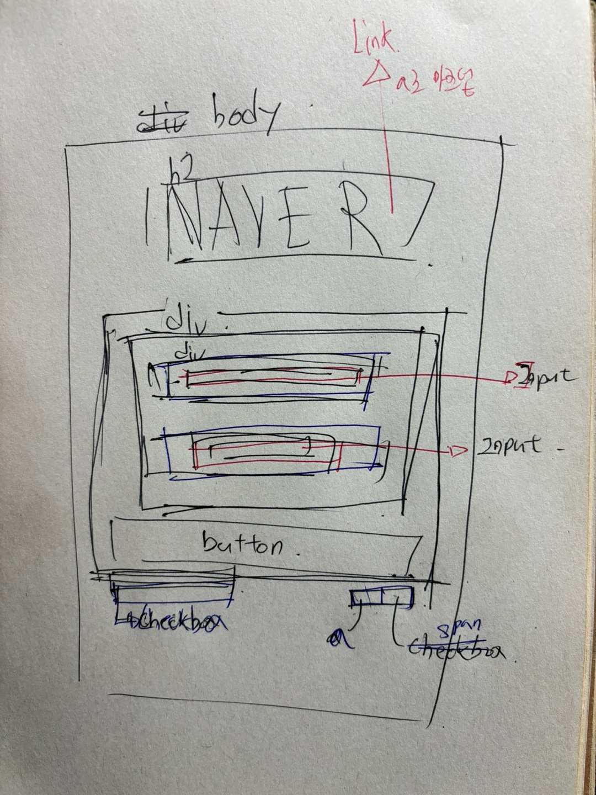

# 5월10일 과제

## 마크업

- 로고 박스 만들기 aria-label="naver-logo" 주고 h1 sr-only로 없애고 이미지 삽입
- 로그인 박스 만들고 안에 input 2개 배치 input 아이디와 label for 을 동일하게 준다.
- 로그인 버튼 제작
- tooltip-group 박스 만들기
- 로그인 상태유지 checkbox
- ip보안 링크 줘야하므로 앵커테그로 만들기
- off.....는 해결하지 못했다. tabindex 를 줘서 키보드로도 접근할수 있도록함

## CSS

- 기본 세팅 불러오기 sr-only, 및 reset 스타일 적용
- login-box 만들고 display:flex 자식요소 가로로 배치
- 반응형으로 만들기 위해 input width 100% 부여
- 버튼 요소도 input 과 같은 크기를 유지하기위해 width 100%
- 로그인 상태 유지버튼 position: relative 부여 자식인 input 에게 position: absolute
- background img 로 체크박스 만들것임으로 기존 checkbox ` appearance: none;` 안보이게함
- 배경이 보일정도로 텍스트 패딩으로 움직임
- ` input:checked + label {
  background-image: url(/Component\ 1.png);
}` input 과 라벨을 같은 아이디로 연결시켜놓아서 label을 클릭해도 input 동작함. 체그하면 다른이미지로 background 변경됨
- 모바일 퍼스트임으로 로그인 유지버튼 float right 로 오른쪽에 배치
- 미디어 쿼리 속성으로 768px 이상일경우 login박스 500px 로 고정
- tooltip-group 에 flex 부여 가로로 정렬시키고 justify-content: space-between; 로 양쪽 끝 정렬
- ip-box none 을 block 으로 바꿔줌
- 로그인 상태 유지박스 focuse 맞추는데 거진 1시간씀.. 인풋박스 위치를 조절해야되는데 outline-offset 을 붙들고 있었다..

## 느낀점

> css 보다 마크업하는데 시간을 더 많이 들였다. 많은 시간을 썼는데.. 사실 지금 마크업이 완벽한지 모르겠다.
> 개발자 도구 접근성 파트를 키고 보았지만.. 아직 많이 부족하다. 짜다보니까 시멘트 속성은 머리속을 떠나버려 결국 다 div로 짜고 aria-label을 부여하고
> 있었다.. 다음 과제부터는 시멘트 마크업을 더 찾아보고 사용해야겠다.

## 한통의 편지..

> 주말에 결혼식과 일이있어.. 시간에 쫒기며 작성하다보니.. 리드미가 정성스럽지 못한점.. 죄송합니다..ㅠㅠ 다음 리드미는 귀염뽕짝하게 작성해보겠습니다.
> 행복한 주말 되세요!

